# Performance Testing on Dedicated Hardware

## Highlights

-   We have successfully achieved the objective of tuning the Zuul Netty port to reach linear scalability compared to its Tomcat version and highlight the benefits of nonblocking IO. To achieve this we did some TCP tweaks and added overrides for the netty’s IO threads.
-   The load test scenario was simulated using the “wrk benchmark” tool which was simulating requests through KeepAlive connections against a target stub which simulated a random 1k payload with a 50ms latency. In a realistic scenario we assume this implementation will be behind a Netscaler/VIP which would reuse connections instead of frequent connections open/close.
    Note: We observed that comparatively tomcat’s APR was much more efficient in cases where there was no KeepAlive, i.e every connection was doing the TCP handshakes.
-   The scalability point with respect to Tomcat vs Netty was determined by discounting the overheads/latencies incurred in the time spent in processing the response content. Based on the table below, we can conclude that tomcat’s scalability point was achieved at 1300 concurrent connections with a throughput of around 16K TPS, whereas the Netty implementation was linearly scalable [we tested upto 2000 connections ~ 28K TPS].
-   Netty response times for maximum load of 2000 connections was around 71 ms, that is a total of ~21ms spent on the wire and in the proxy. The difference in the response time at each load level was almost uniform, this can be attributed to the overhead of processing the increasing server load [overhead of the HTTP codec/network latencies within the stream, @max load we were using 680Mbps on a 1G NIC and network saturation effects contributed to an increase in latency at this load level].
-   Tomcat response time started to increase significantly with increasing connections, which is a composite effect of blocking connections, frequent GC and high number of busy worker threads. This is reflected in the Operating system’s run queue length and the JVM’s GC throughput. Comparison graphs can be found below.

## Equipment and Tool Specification
- Intel(R) Xeon(R) CPU E5430 @ 2.66GHz (dual quad core - total 8 CPU cores).
- Single 1Gbps NICs employed on each server.
- Unspecified Production-grade, low-latency networking equipment utilised for interconnects.
- Mixture of WRK load generator and HP LoadRunner used to provide a sample probe.

## Positives of Netty
 -  Non blocking inbound and outbound – We were able to handle high number of concurrent connections with a significantly low number of threads. This has helped reduce the CPU utilization spent on the Selectors.
 -  Efficiently utilizes the system resources like CPU/network. Even higher throughput can be achieved with bonded or dedicated NICs. Depending upon the additional tasks on the proxy layer we might need additional CPU capacity.
 -  High number of connections doesn’t affect the stability of the ZUUL proxy instance, whereas with Tomcat the instance became unresponsive when the worker threads reach limits.
 -  Memory utilization is very efficient as the temporary stacks created by the number of threads are much less due to its low thread count and also zero-copy request and response content buffers are employed. Higher application throughput is visible in the GC graphs shown below.

## Context Switching
 -  In Netty based ZUUL we observed that the context switches started off at 100K per second and settled at 48K at peak load. This is because at the start of the run the efficiency of the ZUUL proxy is at peak [all threads were active from start of the run] since Netty NIO is event based, this trend matches the TPS and mirrors the response latency.
 -  However, in tomcat the worker threads increases with increase in concurrent connections and leveled off as soon as the throughput settled.

## Configuration
### TCP Parameters
- Increase the OS’s receive and write buffers, net.core.rmem\_max and net.core.wmem_max.
- Maximum number of packets queued on the INPUT side, especially when the NIC receives packets faster than kernel can process them. - net.core.netdev\_max_backlog.
- Increased the backlog per port, net.core.somaxconn and the global limit, tcp\_max\_syn_backlog.

### Netty Overrides
-   -Dxorg.jboss.netty.epollBugWorkaround=true – To enable the epoll CPU fix.
-   -Dxorg.jboss.netty.selectTimeout=10 – This is the default, has effect only when idling.
-   -Dcom.netflix.zuul.workers.inbound=4, -Dcom.netflix.zuul.workers.stage=8 and -Dcom.netflix.zuul.workers.outbound=4 –> IO thread count to limit the inbound NIO.

## Results for Ramped Load Test
Run     |Con.           |Rq./s      |Av./ms             |TP50/ms        |TP75/ms        |TP90/ms        |CPU/%  |LdAvg      |Ctx Sw.            |Mbps
---     |--:            |--:        |--:                |--:            |--:            |--:            |--:    |--:        |--:                |--:
Tomcat	|700	        |12148	    |61.25	            |53.51	        |54.63	        |58.00	        |61.02	|9.30	    |71946.30	        |306.81
Netty	|700	        |13283	    |52.65	            |52.10	        |52.83	        |54.25	        |47.32	|6.93	    |93207.48	        |313.06
Tomcat	|900	        |15277	    |71.55	            |54.80	        |57.29      	|64.19	        |74.12	|14.85	    |74591.69       	|373.70
Netty	|900	        |16701	    |54.01	            |52.72	        |54.24      	|56.98	        |57.50	|7.93	    |89477.57       	|400.00
Tomcat	|1100	        |15385	    |6410.00            |58.81	        |71.22      	|58000.00	    |79.57	|18.10	    |69413.10       	|367.46
Netty	|1100	        |19806	    |55.71	            |53.73	        |56.48      	|60.80	        |64.23	|8.60	    |80201.63       	|475.56
Tomcat	|1300	        |16161	    |1940.00 	        |70.10	        |88.83      	|154.94	        |83.18	|19.79	    |69286.21	        |379.87
Netty	|1300	        |22461	    |57.86	            |55.22	        |60.06      	|67.43	        |70.43	|9.12	    |71283.04	        |540.41
Tomcat	|1500	        |16215	    |109.96	            |85.35	        |113.29     	|151.89	        |84.26	|20.37	    |72201.76	        |392.80
Netty	|1500	        |24294	    |61.70	            |57.42	        |64.68      	|77.24	        |73.89	|9.22	    |62635.39	        |586.07
Tomcat	|1700	        |16137  	|110.83	            |96.36	        |130.57	        |167.38	        |84.66	|21.72	    |71682.80	        |386.01
Netty	|1700	        |26012	    |65.29	            |59.68	        |68.80       	|85.59	        |75.57	|9.34	    |56936.30	        |627.89
Tomcat	|1900	        |15759	    |136.60	            |113.63	        |155.77     	|203.54	        |85.13	|21.33	    |69941.45	        |377.01
Netty	|1900	        |27585	    |68.74	            |62.19	        |72.91      	|92.45      	|77.54	|9.62	    |51156.29	        |666.63
Tomcat	|2000	        |15564	    |159.26	            |120.93	        |166.95     	|218.64        	|65.08	|16.75	    |54500.02	        |291.12
Netty	|2000	        |28196	    |70.87	            |63.92	        |75.58      	|96.34      	|78.96	|9.71	    |48146.36       	|682.39

### Aggregate Performance fn(connections)
Observed Performance                | Resource Utilisation
:-:                                 |:-:
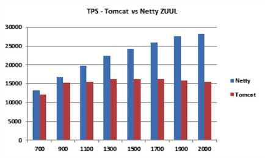              |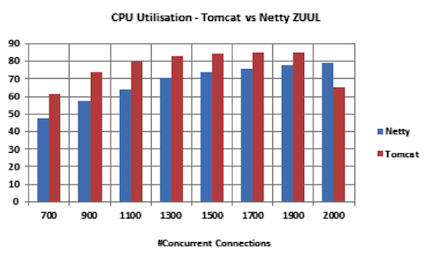
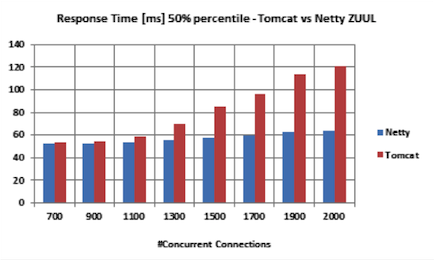            |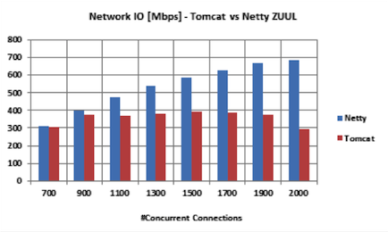
            |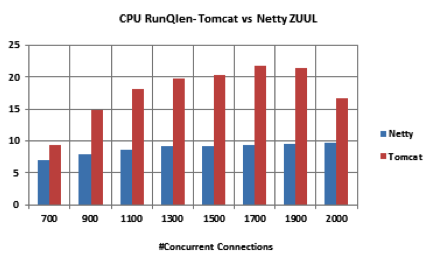

### Result Samples fn(time)
Zuul running on Tomcat                                      |Zuul-Netty
:-:                                                         |:-:
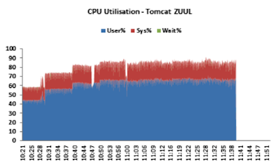           |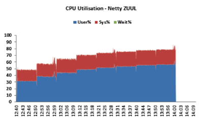
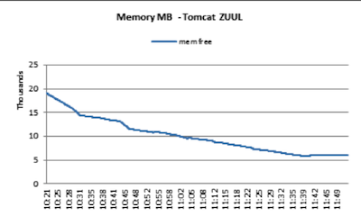           |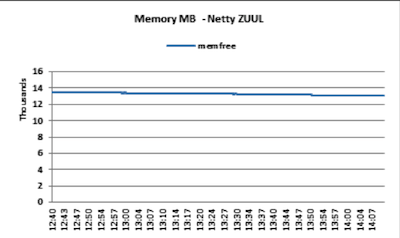
            |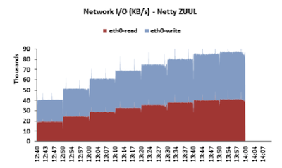
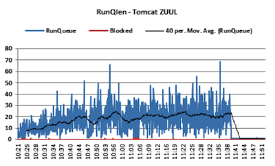          |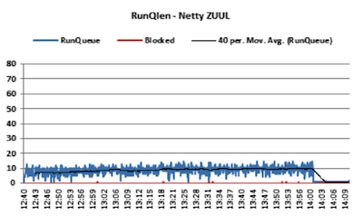
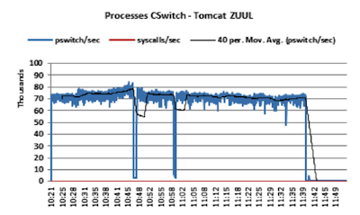      |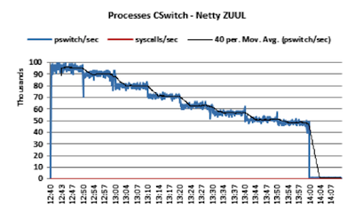
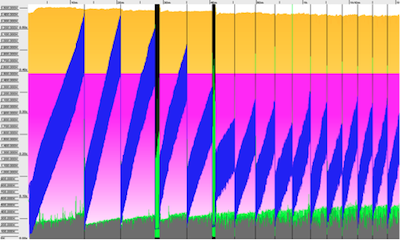                         |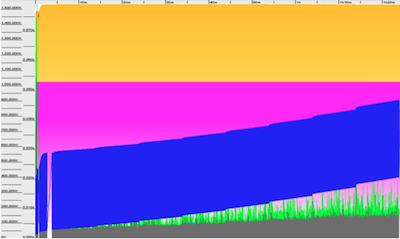

### Take Aways
-   Non-blocking inbound and outbound IO performs much better in terms of linear scalability. A caveat is that all processing filters employed in the proxy must never block the execution stage threads i.e. they must use non-blocking outbound IO e.g. if config services are being contacted by filters synchronously.
-   Time spent in GC is reduced significantly by Netty so long as the request and response buffers are not intercepted in processing filters. Doing so would drag the content into user space and cause an increase in GC utilisation. We chose to carefully expose only the minimum request and response data in the filter API so that the framework developers can make guarantees to filter developers about performance.
-   Netty becomes non-linear in the face of a lot of inbound connection churn. The APR connector performs much better in this case. It should be noted that the performance characteristic is most predictable when a system in our control (e.g. loadbalancer) can guarantee that keep alives will be maintained with the proxy in the face of inbound connection churn.

